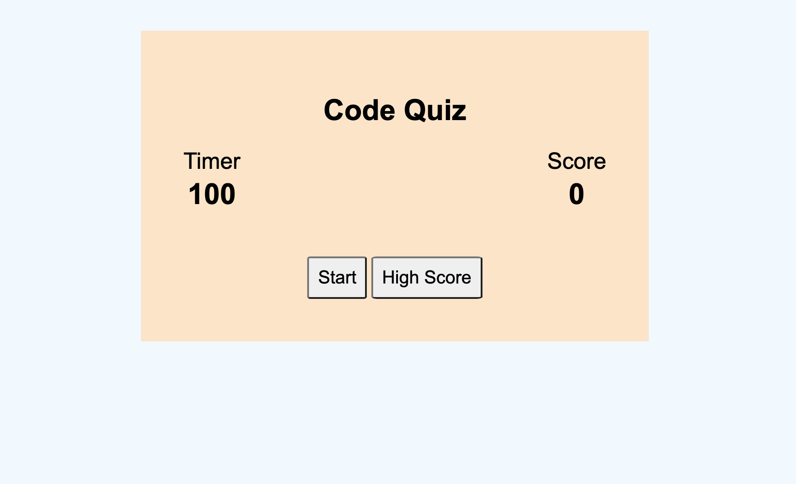
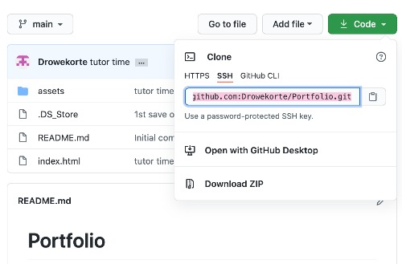

# Code Quiz
A Quiz created with JavaScript! 
## Name

A JS Code Quiz - to test my knowledge AND yours. <br>
https://drowekorte.github.io/Code-Quiz/index.html

<br>

## Description

Quizes are a great way to test your knowledge, but a quiz created with JS is even better! The styleability keeps the user engaged and the functionality makes storing user inputs easy. 
* HTML
* CSS
* JavaScript
<br>


<br>

## Requirements: VSCode

To clone my code for your own project:
* Copy the git SSH to your clipboard <br>

* Create a local file to place the GitHub file into
* Open your terminal, find the file you've just created
* Type
```
Your Computer:~ Your File/ git clone git@github.com:Drowekorte/JS-Password-Generator.git 

```
* ...then, check that you’ve cloned all of the files with...

```
Your Computer:~ Your File/ git status

```

* To open in VSCode, type

```
Your Computer:~ Your File/ git pull

```
* ...and enjoy.

<br>

## Useage
This is used to review my learning process

<br>

## Support
For questions, feel free to contact me at through GitHub

<br>


## Contributing
No contributions at this time

<br>

## Authors and acknowledgment
https://www.w3schools.com/<br>
https://javascript.info/<br>
https://developer.mozilla.org/en-US<br>
https://websitesetup.org/wp-content/uploads/2020/09/Javascript-Cheat-Sheet.pdf<br>

<br>